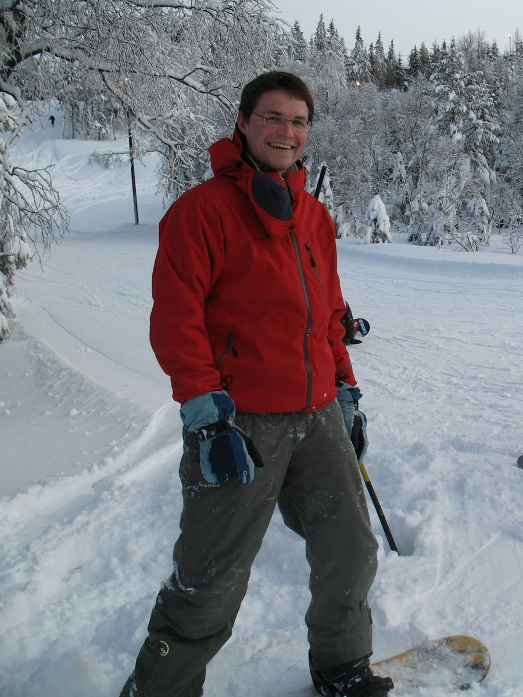

Proud dad, Data/Computational scientist and Engineer in Electronics.

I enjoy [technology at its best](https://www.youtube.com/watch?v=b-jTRkDGTMg), data big or small and programming anything!

Today I want to help liberate and illustrate data to improve everyone's life, empower people and improve governance.

I believe in happiness at work and I am looking for mind blowing projects where I can develop/share my skills among great colleagues.

I love coffee and fresh snow :)

### Get in touch!
<table style="width:150px">
  <tr>
    <td></td>
    <td></td>
    <td></td>
  </tr>
</table>